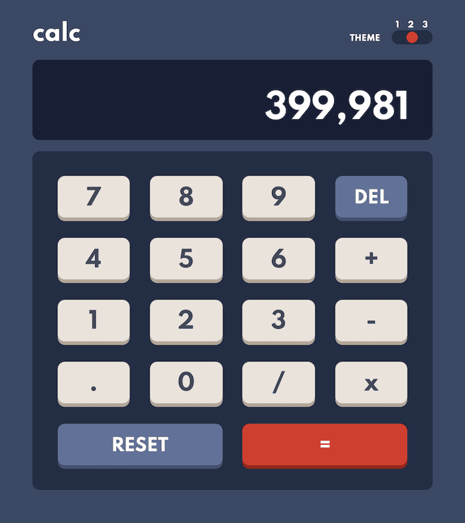

# Frontend Mentor - Calculator app solution

This is a solution to the [Calculator app challenge on Frontend Mentor](https://www.frontendmentor.io/challenges/calculator-app-9lteq5N29). Frontend Mentor challenges help you improve your coding skills by building realistic projects. 

## Table of contents

- [Overview](#overview)
  - [The challenge](#the-challenge)
  - [Future Improvements](#future-improvements)
  - [Screenshot](#screenshot-and-livesite)
- [Built with](#built-with)
- [Author](#author)

## Overview

### The challenge

Users should be able to:

- See the size of the elements adjust based on their device's screen size
- Perform mathmatical operations like addition, subtraction, multiplication, and division
- Adjust the color theme based on their preference
- **Bonus**: Have their initial theme preference checked using `prefers-color-scheme` and have any additional changes saved in the browser

### Future Improvements

- Handle long floating numbers
- Issues with Javascript computation of floating numbers
- Write better JS calculator

### Screenshot and livesite

  

- [Live Site](https://mathieu-superpose.github.io/calculator-app/)

## Built with

- CSS custom properties
- Flexbox
- CSS Grid
- Mobile-first workflow

## Author

- [Website](https://www.tropbeau.site)
- Frontend Mentor - [@ymathieu-superpose](https://www.frontendmentor.io/profile/mathieu-superpose)
